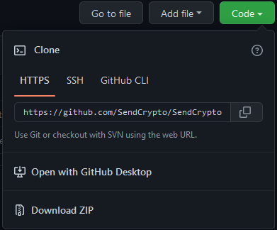
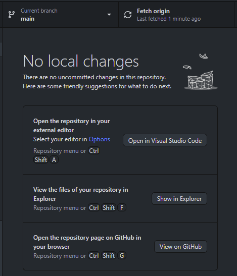

This document describes how to get this code running.

# Obtain a license
First, you'll need to obtain a license.  There is currently no open-source license on the repository code; 
it is (C) 2022 All Rights Reserved.

A limited license is hereby granted to 2022 ETHOnline judges (including sponsor prize judges) to run the code, 
including minor modifications as necessary, for the purposes of evaluating it for ETHOnline 2022 prizes. 

# Get a copy of the code
There are many ways to do this, but the easiest is probably to install
[GitHub Desktop](https://desktop.github.com/), then go to the
[repository homepage on GitHub](https://github.com/SendCrypto/SendCrypto)
and click the Code button in the upper right corner:  
  
and then click Open with GitHub Desktop.
You may need to select the folder where you want the code cloned to.  
For all further instructions, the folder where the repository is stored, where the
[main README](../README.md) can be found, will be referred to as INSTALLDIR.  
From GitHub Desktop, you can open this directory in your file explorer by clicking the
button in the middle row as shown:  
  

# Run the code
This is a Node application with an SQL backend.  The SQL piece may eventually migrate to TableLand but isn't there yet.  
To run, open a terminal and `cd` to INSTALLDIR, then run `npm start`.  
